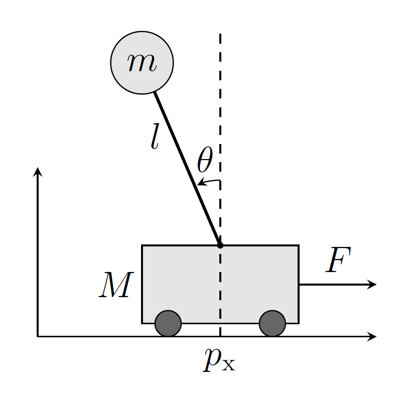

---------------------------------

:::: {#explaining .message-box }

::: {#note-exp .note-header}
```{r, include=knitr::is_html_output(), echo=FALSE,}
knitr::include_graphics("figures/infoicon.svg")
```
**Note**
:::
::: {#note-exp .note-body}

Alle Aufgaben sowie die dazugehörigen Dateien können [hier](http://bioinf.uni-freiburg.de/Lehre/Courses/latest/material/optimierung-uebung4.zip) heruntergeladen werden.

:::

::::

# Einführung in CasADi

[CasADi](https://web.casadi.org) ist eine open-source Toolbox zur schnellen Implementierung von nichtlinearen Optimierungsproblemen.
Der CasADi Code selber ist in C++ geschrieben, aber es gibt Interfaces für Python, Matlab und Octave.
Ableitungen werden automatisch über Algorithmische Differenzierung (AD) berechnet,
ein effizientes und gleichzeitig präzises Verfahren.
Zum Lösen der Probleme kann `CasADi` diese an verschiedene (alleinstehende) Solver übergeben.
Der open-source Solver `IPOPT`, ein nichtlineares Innere-Punkt-Verfahren, ist in einer `CasADi`-Installation bereits enthalten.
Nichtlineare Programme werden in `CasADi` in der Standardform

$$
\begin{align}
& \min_{x \in \mathbb{R}^n}
& & f(x) \\
& \text{s.t.}
& & x_{\text{lb}} \leq x \leq x_{\text{ub}}, \\
& & & g_{\text{lb}} \leq g(x) \leq g_{\text{ub}}
\end{align}
\tag{1}
$$

formuliert, wobei die vektorwertige Funktion $g : \mathbb{R}^n \rightarrow \mathbb{R}^m$ zusammen mit den Begrenzungen $g_{\text{lb}}, u_{\text{lb}} \in \mathbb{R}^m$ die nichtlinearen Nebenbedingungen ausdrückt.
Für dieses Übungsblatt werden wir die Hilfsumgebung [Opti Stack](https://web.casadi.org/docs/#document-opti) nutzen, welche eine Syntax bietet, die sehr nah an die Papiernotation angelehnt ist.
Die so formulierten NLP werden automatisch in die Standardform **(1)** übertragen.

**Aufgaben:**

1. Installieren Sie CasADi. Wenn Sie Anaconda nutzen, aktivieren Sie zunächst das Environment, in dem Sie installieren wollen.
Installieren Sie dort zunächst pip (`conda install pip`), gefolgt von der `CasADi`-Installation mit `pip install casadi`.
Wenn Sie standardmäßig pip verwenden, können Sie CasADi direkt in Ihr gewünschtes Environment installieren.

2. Machen Sie sich mit den bereitgestellten Codebeispielen vertraut und führen diese aus.
`puppy.py` enthält eine Implementierung der Bildrekonstruktion, die Sie bereits aus Übung 2 kennen.
`chain.py` implementiert eine hängende Kette.
Beide Beispiele werden in den folgenden Abschnitten kurz vorgestellt.

---

## Beispiel 1: Bildrekonstruktion

Wir haben ein verrauschtes schwarz-weiß Bild in Form der Matrix $Y \in \mathbb{R}^{r \times c}$ gegeben, sodass die Elemente die Intensität der einzelnen Pixel definieren, $0 \leq Y_{i,j} \leq 256$.
Ziel ist es, eine weniger verrauschte Version $X \in \mathbb{R}^{r \times c}$ zu rekonstruieren. Dies kann als das unbeschränkte Optimierungsproblem formuliert werden.

$$
\min_{X \in \mathbb{R}^{r \times c}} \sum_{i=1}^r \sum_{j=1}^c \left( \sqrt{(X_{i,j} - Y_{i,j})^2 + 1} + \alpha \sqrt{(X_{i,j} - X_{i+1,j})^2 + (X_{i,j} - X_{i,j+1})^2 + 1} \right)\tag{2}
$$


```{r, echo=FALSE, out.width='40%', fig.align='center', fig.show='hold', fig.cap='**Abbildung 1** - Beispiel einer durch Lösung von Problem **(2)** erhaltenen Rekonstruktion. Links: Verrauschtes Original Y. Rechts: Rekonstruierte Version $X$ mit $\\alpha = 0.5$.'}
knitr::include_graphics(c("figures/sheet-5/p1.png", "figures/sheet-5/p2.png"))
```

formuliert werden. Hierbei haben wir "Phantompixel" $X_{r+1,j}$ und $X_{i,c+1}$ angenommen, mit $X_{r+1,j} = X_{r,j}$ und $X_{i,c+1} = X_{i,c}$, um das Definieren der Summenindizes zu erleichtern.
Abbildung 1 zeigt ein Beispiel einer so erhaltenen Rekonstruktion mit $\alpha = 0.5$.

---

## Beispiel 2: Bildrekonstruktion

Wir betrachten eine Kette, bestehend aus $N$ Massepunkten, die durch $N-1$ Federn verbunden sind.
Die Massepunkte haben Masse $m$ und Positionen $(y_i, z_i) $, mit ${i = 0, \ldots, N}$.
Die beiden äußersten Massepunkte sind fixiert, $(y_1, z_1) = (-2, 1)$ sowie $(y_N, z_N) = (2, 1)$.
Wir wollen eine Ruheposition der Kette finden, was der Minimierung der Kettenenergie $V(y, z)$ entspricht.
Diese setzt sich zusammen aus der Lageenergie der Massen sowie der potentiellen Energie der Federn:

$$
V(y, z) = \sum_{i=0}^{N} mgz_i + \frac{1}{2} \sum_{i=0}^{N-1} D \left( (y_i - y_{i+1})^2 + (z_i - z_{i+1})^2 \right),
\tag{3}
$$

wobei $g$ die Erdbeschleunigung ist und $D$ die Federkonstante.
Wir führen nun zwei Variationen dieses Problems ein.

1. Unterhalb der Kette befindet sich eine ebene Fläche, die die Kette nach unten beschränkt.
Dies drücken wir durch die Nebenbedingung $z_i \geq 0$ aus.
2. Unterhalb der Kette befindet sich ein Hügel. Diesen drücken wir durch die Nebenbedingung $z_i \geq -y_i^2$ aus.

Alles zusammen führt uns zu folgenden nichtlinearen Programmen:

**Variation 1**
$$
\begin{align}
\underset{y,z \in \mathbb{R}^N}{\text{min}} \quad & V(y, z) \\
\text{s.t.} \quad & (y_1, z_1) = (-2, 1), \\
& (y_N, z_N) = (2, 1),  \\
& z_i \geq 0, \quad 1 \leq i \leq N
\end{align}
\tag{4}
$$

**Variation 2**
$$
\begin{align}
\underset{y,z \in \mathbb{R}^N}{\text{min}} \quad & V(y, z)\\
\text{s.t.} \quad & (y_1, z_1) = (-2, 1), \\
& (y_N, z_N) = (2, 1), \\
& z_i \geq -y_i^2, \quad 1 \leq i \leq N
\end{align}
\tag{5}
$$

Beachten Sie, dass es sich bei NLP **(4)** um ein konvexes QP handelt (wieso?), während **(5)** ein nichtkonvexes NLP ist. In `chain.py` finden Sie eine vollständige Implementierung beider Probleme hier von. Abbildung 2 zeigt die Lösungen der beiden Variationen. Für Variation 2 sind zwei mögliche Lösungen dargestellt.

```{r, echo=FALSE, out.width='80%', fig.align='center', fig.show='hold', fig.cap='**Abbildung 2** - Illustration der hängenden Kette in beiden Variationen'}

```

---

# Aufgabe 1 - Optimale Kreisplatzierung

Im Rahmen eines Produktionsprozesses sollen fünf Kreise, $s_1, \ldots, s_5$, aus einer quadratischen Platte mit Kantenlänge $a = 10$ cm ausgeschnitten werden.
Drei dieser Kreise sollen den Radius $R$ haben, die anderen beiden den Radius $2R$.
Die Position eines Kreises $s_i$ auf der Platte ist durch die Koordinaten $(x_i, y_i)$ seines Mittelpunktes bestimmt.
Ziel ist es, die Kreise so anzuordnen, dass der Radius $R$ so groß wie möglich gewählt werden kann.
Dabei muss sowohl sichergestellt werden, dass alle Kreise auf der Platte liegen, als auch dass sich diese nicht überschneiden.

Eine Illustration der Situation ist in Abbildung 3 gegeben.

```{r, echo=FALSE, out.width='50%', fig.align='center', fig.show='hold', fig.cap='**Abbildung 3** - Beispiel einer möglichen - aber nicht optimalen - Anordnung der Kreise.'}

```

Wir können dies als das folgende nichtlineare Optimierungsproblem ausdrücken:

\[
\begin{aligned}
\min_{R, x_1, \ldots, x_5, y_1, \ldots, y_5} \quad & -R \\
\text{s.t.} \quad & x_i - r_i(R) \geq 0, & i = 1, \ldots, 5, \\
& x_i + r_i(R) \leq a, & i = 1, \ldots, 5, \\
& y_i - r_i(R) \geq 0, & i = 1, \ldots, 5, \\
& y_i + r_i(R) \leq a, & i = 1, \ldots, 5, \\
& (x_i - x_j)^2 + (y_i - y_j)^2 \geq (r_i + r_j)^2, & i, j = 1, \ldots, 5, i < j,
\end{aligned}
\]

mit $r_i(R) = R$ für $i \in \{1, 2, 3\}$ und $r_i(R) = 2R$ für $i \in \{4, 5\}$.

**Aufgaben:**

1. Diskutieren Sie kurz, ob das Problem konvex ist.
2. Vervollständigen Sie das bereits gestellte Template, um das Optimierungsproblem mit `CasADi` und `IPOPT` zu lösen. Wie groß ist der Radius, den Sie erhalten?
3. Im Template war bereits eine konkrete Initialisierung der Entscheidungsvariablen gegeben. Verändern Sie diese, um mindestens eine bessere Lösung zu erhalten.
Was ist die beste Lösung, die Sie finden können?
Ist es möglich, dass es eine noch bessere gibt?

---

# Aufgabe 2 - Optimale Steuerung eines Pendels

```{r, echo=FALSE, out.width='80%', fig.align='center', fig.show='hold', fig.cap='**Abbildung 4** - Links: Skizze des Pendels. Rechts: Trajektorie des Pendels mit Initialzustand $x_0 = \\left[\\frac{3\\pi}{4} \\quad 0\\right]^T$ und ohne Steuerung, $u_k = 0 \\forall k$.'}

```

Wir betrachten ein Pendel.
Dessen Position ist durch den Winkel $\theta$ eindeutig bestimmt. Dabei entspricht $\theta = \pi$ der Position, in der es gerade nach unten hängt.
Eine Illustration finden Sie in Abbildung 4.
In der Aufhängung des Pendels sitzt ein Motor, sodass es anhand eines Drehmoments $u$ gesteuert werden kann.
Die Winkelgeschwindigkeit ist $\omega = \dot{\theta}$.
Fassen wir Position und Geschwindigkeit im Zustandsvektor $x = \begin{bmatrix} \theta \quad \omega \end{bmatrix}^T$ zusammen, können wir die Dynamik des Pendels durch die gewöhnliche Differentialgleichung (ordinary differential equation, ODE)

$$
\dot{x} = \begin{bmatrix} \dot{\theta} \\
\dot{\omega} \end{bmatrix} = f(x, u) := \begin{bmatrix} \omega \\
\sin \theta + u \end{bmatrix}
$$

beschreiben. (Zur Vereinfachung haben wir hier alle Einheiten ignoriert. Eigentlich müsste vor den Sinus ein Faktor mit Einheit,
da dieser dann mit dem Drehmoment summiert wird.)


Wir betrachten das Pendel über die Zeitdauer $T$ und diskretisieren diese in $N$ Zeitschritte.
Zur Simulation verwenden wir das [Runge-Kutta-Verfahren](https://de.wikipedia.org/wiki/Klassisches_Runge-Kutta-Verfahren).
Ordnung (RK4) und erhalten dadurch die diskretisierte Dynamik

$$
x_{k+1} = F_{h}(x_k, u_k),
$$

wobei $x_k$ der Zustand zum diskreten Zeitpunkt $k$, $k = 0, \ldots, N$, und $h = \frac{T}{N}$ der Integrationschritt ist.
Wir fassen die Zustände und die Steuerungsinputs zu allein Zeitpunkten in den Matrizen

$$
X := \begin{bmatrix} x_0 & \ldots & x_N \end{bmatrix} \in \mathbb{R}^{2 \times (N+1)} \quad \text{und} \quad U := \begin{bmatrix} u_0 & \ldots & u_{N-1} \end{bmatrix} \in \mathbb{R}^{1 \times N}
$$

zusammen.


Unser Ziel ist es nun, das Pendel aus seiner herabhängenden Ruhelage $\bar{x}_0 = \begin{bmatrix} \pi & 0 \end{bmatrix}^T$ zum Zeitpunkt $k = 0$ in die aufrechte stehende Position $\bar{x}_N = \begin{bmatrix} 0 & 0 \end{bmatrix}^T$ zum Zeitpunkt $k = N$ zu schwingen.
Dabei wollen wir den Steuerungsaufwand $L(U) := \sum_{k=0}^{N-1} u_k^2$ minimieren.

**Aufgaben:**

1. Formulieren Sie unser Optimalsteuerungsproblem als nichtlineares Programm. Dabei sollen $x_0, \ldots, x_N$ und $u_0, \ldots, u_{N-1}$ die Entscheidungsvariablen sein.
Die Nebenbedingungen sind die Dynamik, sowie die Start- und Zielposition.
2. Diskutieren Sie kurz, ob das Problem konvex ist.
3. Benutzen Sie das bereitgestellte Template, um das NLP mit `CasADi` und `IPOPT` zu lösen.
Erstellen Sie Plots der optimalen Trajektorien von $\theta$, $\omega$ und $u$, mit der diskreten Zeit $k$ auf der $x$-Achse.
Sie können Ihre Lösung außerdem mit der bereitgestellten Animation (`pendulum.gif`) vergleichen.
4. Wir führen nun eine zusätzliche Beschränkung der Steuerung ein.
Zu allen Zeitpunkten soll gelten: $|u_k| \leq u_{\text{max}}$.
Diskutieren Sie kurz, wie sich der optimale Wert der Zielfunktion dadurch verändert.
5. Erweitern Sie Ihre NLP Formulierung um die zusätzliche Beschränkung.
Beachten Sie, dass Sie hierbei die Betragsfunktion $| \cdot |$ nicht verwenden sollten, da diese an der Stelle 0 nicht differenzierbar ist.
Dies kann zu Problemen führen.
Finden Sie stattdessen eine Umformulierung dieser Nebenbedingung.
6. Erweitern Sie Ihre Implementierung um die zusätzliche Nebenbedingung.
Verwenden Sie $u_{\text{max}} = 0.13$.

---


# Aufgabe 3: Optimalsteuerung mit `acados` (Bonus)

In dieser Aufgabe lernen wir das open-source Softwarepaket `acados` kennen.
`acados` bietet eine Sammlung effizienter Algorithmen, die auf das Lösen von Optimalsteuerungsproblemen spezialisiert sind.
Dafür implementiert `acados` ein SQP-Verfahren sowie numerische Integratoren für Differentialgleichungen.
Zum Lösen der im SQP-Verfahren anfallenden QP wird auf moderne open-source QP-Löser zurückgegriffen, z.B. HP ipm, qpOASES, OSQP, DQAP.
Optimalsteuerungsprobleme werden mit

```{r, echo=FALSE, out.width='40%', fig.align='center', fig.show='hold', fig.cap='**Abbildung 5** - Illustration des Pendels auf einem Wagen.'}

```

`CasADi`'s symbolische Variablen definieren, welches auch zur Berechnung von Ableitungen verwendet wird. Für die grundlegenden Operationen der linearen Algebra (z.B. Matrix-Matrix-Multiplikationen) wird `BLASFEO` verwendet. Auf Grundlage der erwähnten Komponenten generiert acados dann C-Code, welcher ohne externe Abhängigkeiten auskommt. Dieser kann insbesondere auch auf eingebetteten Systemen ausgeführt werden, was die Optimalsteuerung technischer Systeme in Echtzeit ermöglicht. Unter folgenden Links finden Sie weitere Informationen:

- [Dokumentation](https://docs.acados.org/)
- [Installation](https://docs.acados.org/installation/)
- [Python-Interface Installation](https://docs.acados.org/python_interface/)
- [acados OCP-Formulierung](https://github.com/acados/acados/blob/master/docs/problem_formulation/ocp_mex.pdf)
- [acados Forum](https://discourse.acados.org)

**Pendel auf einem Wagen**

Als Beispielproblem betrachten wir ein Pendel, das auf einem Wagen befestigt ist, siehe Abb. 5. Der Mittelpunkt des Wagens hat die horizontale Position $p_x$, welche wir durch Ausüben einer Kraft $F$ beeinflussen können.
Die Auslenkung des Pendels, welches die Länge $l$ hat, ist durch den Winkel $\beta$ beschrieben.
Der Wagen hat die Masse $M$, und an der Spitze des Pendels ist ein Ball mit Masse $m$ befestigt.
Auf die Pendelmasse wirkt außerdem die Erdbeschleunigung $g$.
Die horizontale Geschwindigkeit des Wagens ist $v_x$ und die Winkelgeschwindigkeit des Pendels ist $\omega$.
Durch Zusammenfassen der (Winkel)positionen und -geschwindigkeiten im Zustandsvektor $x$ können wir das System durch folgende Differentialgleichung beschreiben:


$$
x = \begin{bmatrix} p_x \\ \theta \\ v_x \\ \omega \end{bmatrix}, \quad \dot{x} = f(x, u) = \begin{bmatrix} v_x \\ \omega \\ \frac{-m l \omega^2 \sin \theta + m g \cos \theta \sin \theta + F}{M + (1 - \cos^2 \theta) m} \\ \frac{-m l \omega^2 \cos \theta \sin \theta + F \cos \theta + (M + m) g \sin \theta}{l (M + (1 - \cos^2 \theta)) m} \end{bmatrix}
$$

Unser Ziel ist es nun das Pendel aus einer herabhängenden Position in eine aufrechte Position ($\beta = 0$) zu schwingen, während der Wagen am Ende die Position $p_x = 0$ haben soll.
Unser Steuerungseingang ist hierbei $u = F$. Dies soll innerhalb des Zeitintervalls $t \in [0, T]$ passieren.
Wir drücken dies als das folgende Optimalsteuerungsproblem aus,

$$
\min_{x(\cdot), u(\cdot)} \int_0^T \frac{1}{2} x(t)^T Q x(t) + \frac{1}{2} u(t)^T R u(t) dt + \frac{1}{2} x(T)^T Q_e x(T)
$$

unter den Nebenbedingungen

$$
\begin{aligned}
x(0) &= \bar{x}_0, \\
\dot{x}(t) &= f(x(t), u(t)), \quad t \in [0, T], \\
-u_{\text{max}} &\leq u(t) \leq u_{\text{max}}, \quad t \in [0, T].
\end{aligned}
$$

wo bei $\hat{x}_0$ der gegebene initiale Zustand des Systems ist.

Anders als wir es bisher in der Vorlesung gesehen haben, sind in dem obigen Optimalsteuerungsproblem die Entscheidungsvariablen $x(\cdot)$ und $u(\cdot)$ Funktionen der Zeit.
Es handelt es sich deshalb nicht um ein NLP, und wir können es auch nicht ohne weiteres auf einem Computer repräsentieren.
Hierfür muss es erst durch numerische Integration in der Zeit diskretisiert werden, wie wir es bereits in der vorherigen Aufgabe mit dem RK4-Verfahren gemacht haben.
Da allerdings `acados` dies für uns übernimmt und eine Vielzahl effizienter Integrationsverfahren hierfür bereitstellt, übergeben wir das Optimalsteuerungsproblem in kontinuierlicher Zeit.

**Aufgaben:**

1. Installieren Sie `acados` sowie das zugehörige Python-Interface.
Die Links dafür sind weiter oben gegeben. Versichern Sie sich, dass Ihre Installation funktioniert, indem Sie das Minimalbeispiel `minimal_example_ocp.py` ausführen (vgl. Installationsanleitung Python-Interface).
2. Das Optimalsteuerungsproblem ist für Sie bereits in `cartpole.py` implementiert. Machen Sie sich kurz mit dem Code vertraut und führen Sie ihn dann aus.
3. Wir wollen eine zusätzliche Nebenbedingung auf die Geschwindigkeit $v_x$ einführen. Diese ist

$$
-v_{\text{max}} \leq v_{x}(t) \leq v_{\text{max}}, \quad t \in [0, T],
$$

mit $v_x = 5 \, \frac{\text{m}}{\text{s}}$. Erweitern Sie `minimal_example_ocp.py` um diese Nebenbedingung, und lösen Sie das Optimalsteuerungsproblem erneut.
